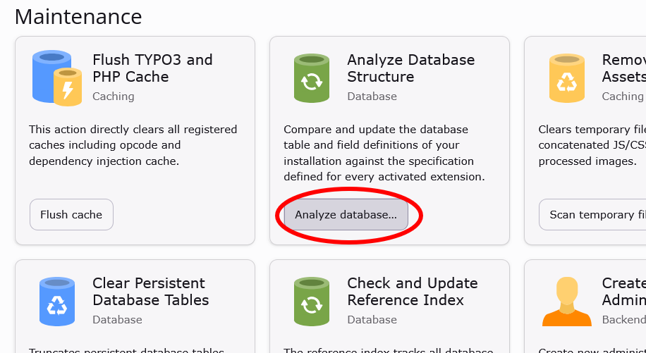
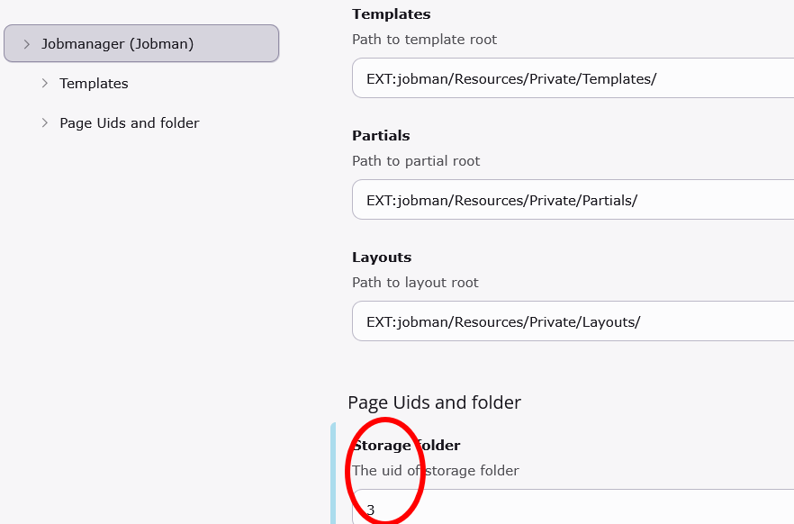
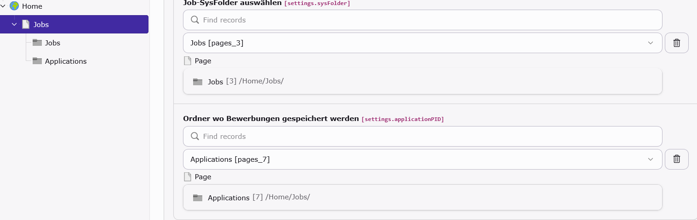
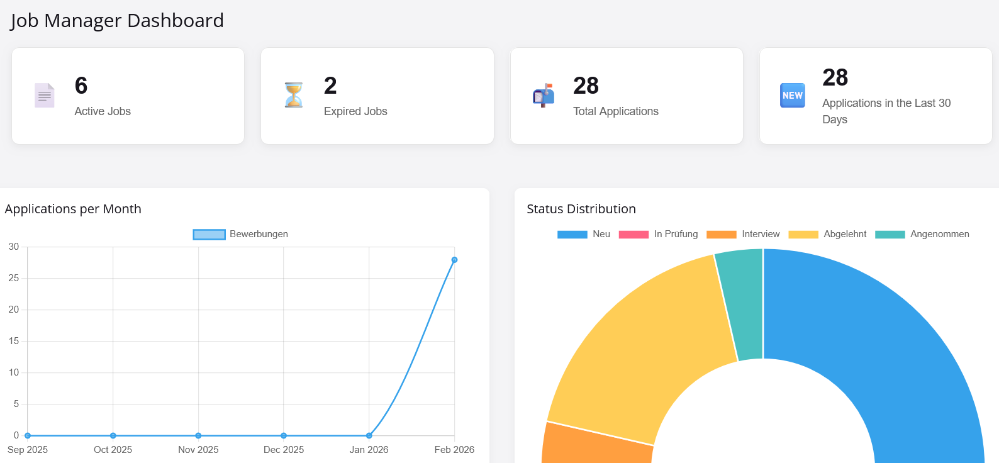

# Job Manager Extension (TYPO3)

With this Job Manager extension, you can easily publish job listings on your website. Interested candidates and applicants have the opportunity to apply directly via an application form, including file attachments.

## Features

- Job listings with structured data (Google for Jobs compatible)

- Flexible frontend display (list, detail view, custom layouts)

- Backend dashboard with statistics and charts

- tt_address integration for contact data

- Site Settings support (multi-site ready)

- TYPO3 13 LTS & 14 LTS compatible

- Composer & Classic installation supported

# Installation

## Installation via Composer (recommended)
Install the extension using Composer:
`composer require lanius/jobman`

### After installation:

1. Log in to the TYPO3 backend
2. Go to Admin Tools → Extensions
3. Activate the extension Job Manager
4. Add the extension to the Site Settings to enable site-specific configuration
5. Run the database updates via the Upgrade Wizard if required

# Setup & Configuration
Create a folder where the job postings will be stored.
Applications must also be stored in a folder — either in the same folder or in a separate folder that you create specifically for the applications. 

Go to the Site Settings and, in the section “Sets for this Site”, add the Site Set (Jobmanager).

Go to the Site Settings and navigate to the Jobmanager (Jobman) section. Enter the UID of the folder where the job postings will be stored and click Save.

You can also change the template paths here, for example if you want to override the templates in your site package.

Create a page in the page tree where the jobs will be displayed and add the Jobmanager plugin to this page. Then configure the Flexform settings in the plugin to specify the folders where job postings and applications should be stored. ALL RIGHTS!

# SEO URLs

For SEO-friendly URLs, you need to add the following at the end of the config.yaml file:
`imports:
  -
    resource: 'EXT:jobman/Configuration/Routes/Jobman.yaml'`

# Backend Modules

## Dashboard
